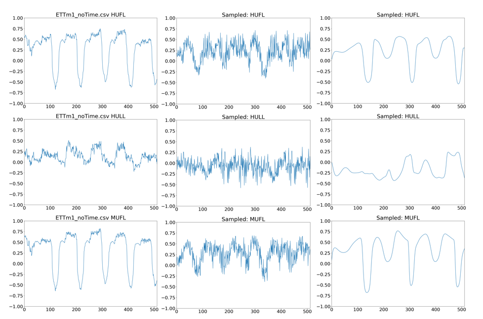

# About page

Junior Data Scientist. Hier stehen Exemplare meiner Arbeit.

# 1. Bachelorarbeit
Originalname "Experiments on synthetic Data Time Series Generation using Deep Convolutional GANs"

<!-- # "Experiments on synthetic Data Time Series Generation using Deep Convolutional GANs" -->

Die Generierung von Zeitserien ist ein Multidimensionales Thema mit vielen Anwendungsbereichen. Klimawandel, Verkaufszahlen, Biologische Prozesses und mehr können als Zeitserien abstrahiert werden. 

In meiner Abschlussarbeit habe Ich Zeitserien von Sensoren in verschiedenen industriellen Bereichen 
erstellt. Dazu habe Ich WaveGAN (https://arxiv.org/pdf/1802.04208) als "Template" genommen und sämtliche ganzheitliche Achitekturänderungen gemacht.

Die größte änderung war die Addierung von Long-Short-Term-Memory in der üblichen Faltung mit der WaveGAN operierte um upsampling-noise entgegenzuwirken, sowie exklusion von bestimmten schichten und Hyperparameteroptimierung.

Resultat war eine Halbierung der Trainingszeit und eine Weitgehende verbesserung der Zeitserien.

# Passager

Bennant von "keyword" + "Passager" handelt es sich hierbei um einen Password Manager, funktionierend mit kxdb Datein und ein Passwordgenerator mit sicheren 128 Hashkeys für erhöte sicherheit. 

Komplett Programmiert in Nativen Java in Android Studio.

# Immolink - (Link hier)

Dynamischer und text basierte suche für immobilien.

Irgendwann ist es soweit - Studium ist abgeschlossen und die Wohnungssuche geht los. Dabei bekamm Ich die Idee, eine Semantische Suche selber zu kreieren um den Prozess ggf. zu beschleunugen. Dabei tickt der User keine übliche Filter - er schreibt lediglich was er möchte in Plaintext, und das Programm extrahiert davon alles - Preis, Ort, usw. 

 Hier kann Ich klar sagen: Durch ein lokales LLM wie Deepseek oder API basiertes wie ChatGPT wird dies recht einfach. Man gibt den User Input und eine vordefinierte Struktur wie XML und bekommt die Infos die man braucht. Ich wollte es aber mit gängigem und zugänglichen Tools erledigen.

 Für Daten habe Ich Deutsche Immobilien in Kaggle benutzt, da das Dynamische Scrapen von Auflistungen leider gegen den Nutzungsbedingungen von jeder großen Immobiliendatenbank ist deshalb mittels der Kaggle Datenbank simuliert wird. Sonst wäre es mit Tools wie Beatifulsoup erstellt und für verschiedene Websites angepasst.

 Die Suche selber passiert auf 2 Ebenen: A. Die Regedix (?) analyse durch lemmanisierung und B. Die Semantische Suche selber

A. Regedix hier

B. Für die Semantische Suche wurden erst alle Auflistungsbeschreibungen und Austattungen durch ein Vector Embedder (in diesem Fall "all-MiniLM-L6-v2") im Vektorbereich kodiert. Der User Input wird dann auch so wie geschrieben embedded (lemmanisiert wird hier nicht da all-MiniLM-L6-v2 strukturempfindlich ist). Letztens wird der User Input mit den Auflistungen verglichen und die 20 mit den der größten sinusetwas änligkeit Angezeigt

Letztes dient Streamlit als das Frontend und host.

     

